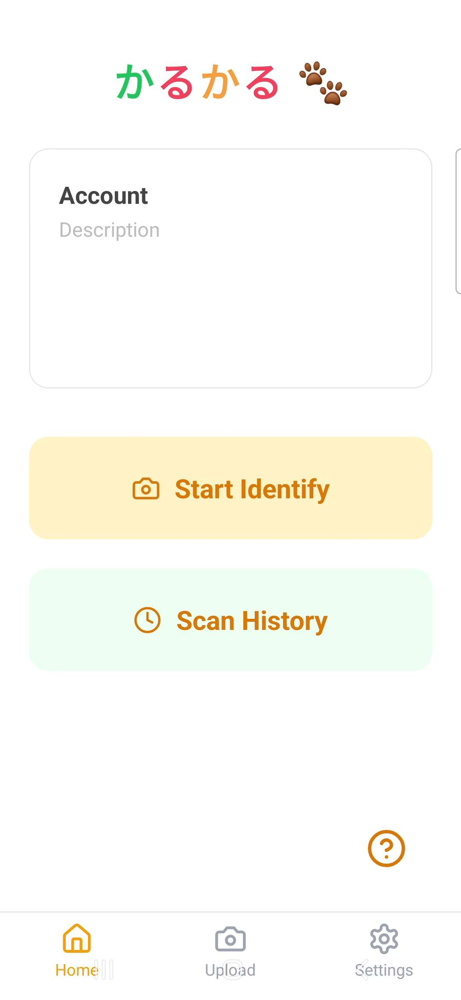

# Smart Re-Identification System for Stray Cats Post-TNR Program

A mobile application built with React Native and integrated with an image-based cat re-identification system to prevent redundant medical treatments of stray cats. This system is designed to support volunteers, animal hospitals, and TNR organizations, especially in the Kansai region of Japan. This project is made as a part of a Project-Based-Learning Course which spans over 15 weeks.

**Project Pipeline & Model Workflow:**
1. Users upload or capture a cat image via the mobile app or web interface.
2. The backend detects and crops the cat face using a YOLO-based detector.
3. The processed image is passed through a Siamese neural network (EfficientNetB3 backbone) to generate a 128-dimensional embedding.
4. The embedding is compared to a database of known cat embeddings using Euclidean distance.
5. If a match is found (distance below threshold), the system returns the cat's profile and medical info; otherwise, it provides guidance for registration.
6. Results and confidence scores are displayed in a user-friendly UI on both web and mobile platforms.

Here is the Project's Documentation Website: [Project Documentation Website](https://xknt21.github.io/)

## Figures

Below are a few key images from the project repository. They are included here to make it easier to understand the mobile experience and the model outputs.

- Mobile preview: mobile-app_preview.jpg

  

  A screenshot mockup of the Expo/React Native mobile app used by volunteers. The preview shows the main identification flow: capture or upload an image, run the identification, and display the match result with confidence. This image helps reviewers understand the mobile UX and how the backend re-ID results surface to users.

- Figure 1: Figure_1.png

  

  Training and evaluation curves for the contrastive Siamese model (accuracy and loss over epochs). This figure illustrates training stability and the validation performance used to pick the final model checkpoint.

- Figure 2: Figure_2.png

  

  Visualization of dataset composition and distribution (images per class / cat). This helps explain why certain classes may be under-represented and informs future data collection priorities.

## Dataset Source

This project uses high-quality cat re-identification datasets, originally scraped and organized for machine learning research:

- **Kaggle Dataset:** [Cat Re-Identification Image Dataset](https://www.kaggle.com/datasets/cronenberg64/cat-re-identification-image-dataset)
- **HelloStreetCat Dataset:** [HelloStreetCat Individuals Dataset](https://www.kaggle.com/datasets/tobiastrein/heellostreetcat-individuals?select=001-brother-valentine)
- **Scraping Toolkit:** [WebScrape_neko-jirushi GitHub Repository](https://github.com/cronenberg64/WebScrape_neko-jirushi)

---

### **Detailed Model Architecture**

#### **1. Siamese Network Structure**
- **Input:** Two (contrastive) or three (triplet) images, each resized to 200x200x3.
- **Backbone:**
  - Pretrained EfficientNetB3 (default), VGG16, or MobileNetV2 (configurable).
  - The backbone processes each image independently (shared weights).
- **Embedding Head:**
  - Global Average Pooling (if not present in backbone)
  - Dense layer (128 units, ReLU activation)
  - Optional Batch Normalization and Dropout for regularization
  - **Output:** 128-dimensional L2-normalized embedding vector for each image

#### **2. Loss Functions**
- **Contrastive Loss:**
  - For a pair of images (x1, x2):
    - Compute Euclidean distance between embeddings: D = ||f(x1) - f(x2)||
    - Loss = y * D^2 + (1 - y) * max(0, margin - D)^2
      - y = 1 for positive pair (same cat), 0 for negative pair
      - margin = 1.0 (configurable)
- **Triplet Loss:**
  - For a triplet (anchor, positive, negative):
    - Loss = max(0, D(anchor, positive) - D(anchor, negative) + margin)
    - margin = 0.2 (configurable)

#### **3. Training Details**
- **Optimizer:** Adam (learning rate 0.0001)
- **Batch Size:** 16 (configurable)
- **Epochs:** 50 (production), 1 (debug)
- **Data Augmentation:** Optional (flip, rotate, noise)
- **Early Stopping:** Monitors validation loss
- **Learning Rate Scheduler:** Reduces LR on plateau

#### **4. Inference Pipeline**
- **Preprocessing:**
  - Detect and crop cat face (YOLO-based detector)
  - Resize to 200x200, normalize to [0,1]
- **Embedding Extraction:**
  - Pass image through backbone and embedding head
- **Matching:**
  - Compute Euclidean distance to all known cat embeddings
  - If distance < threshold (0.4), report as match
  - Otherwise, report as no match

#### **5. Model File Formats**
- **Training:** Saved as Keras .h5 (with custom objects) or TensorFlow SavedModel (recommended for deployment)
- **Deployment:** Loads SavedModel or .h5 (if compatible)

#### **6. Customization**
- All architecture parameters (backbone, embedding size, margin, etc.) are configurable in `config_siamese.py`.
- Easily switch between contrastive and triplet loss modes.

---

### Related Research

This project builds upon the research presented in:

- **Research Paper:** [Siamese Networks for Cat Re-Identification: Exploring Neural Models for Cat Instance Recognition](https://arxiv.org/pdf/2501.02112v1) (Trein & Garcia, 2024)
- **Implementation Repository:** [Hello Street Cat Reidentification](https://github.com/TobiasTrein/hsc-reident/tree/main?tab=readme-ov-file) by Tobias Trein

The research paper demonstrates the effectiveness of Siamese Networks for cat re-identification using VGG16 with contrastive loss on a dataset of 2,796 images of 69 cats from the Hello Street Cat initiative.

## Project Objective

To streamline the Trap-Neuter-Return (TNR) process and reduce unnecessary hospital visits for stray cats in the Kansai region of Japan by enabling users to:

- Identify previously captured and treated cats using AI-based image matching.
- View and manage cat profiles with medical histories.
- Coordinate efficiently between caretakers, hospitals, and organizations.
- Ensure data integrity, usability, and privacy compliance.

## Features

### Cat Re-Identification
- Upload or capture a photo of a stray cat to check for prior registration.
- AI provides a confidence score and match result (high, moderate, or low).
- Feedback system for users to report false matches.

### Account Management
- Role-based access for Volunteers, Animal Hospitals, and Administrators.
- Profile creation, editing, verification, and deletion supported.
- Password recovery and secure authentication mechanisms.

### Medical Record System
- View and update cat profiles: age, gender, vaccination status, and treatment history.
- Hospitals can log surgeries and medical interventions.
- Tagging system (e.g., neutered, under treatment, released).

### Image Submission Workflow
- Supports photo capture via device camera or gallery upload.
- Validates format, size, and resolution (≥ 1280x720, ≤ 5MB).
- Mobile and offline-capable submission process.

### Administration & Analytics
- System dashboards for match statistics and cat counts.
- Access control, audit logs, and activity tracking.
- Re-ID match reviews and visualization of trends.

## Target Users

| Role            | Description                                                                 |
|-----------------|-----------------------------------------------------------------------------|
| Volunteers      | Submit cat sightings, upload images, and help reduce redundant captures.   |
| Animal Hospitals| Update medical histories, create/edit profiles, and manage treatment logs. |
| Administrators  | Oversee system users, manage content, and monitor analytics.               |

## Deployment Scope

- Initial deployment in Kansai Region, Japan.
- Supports up to 1000 volunteers and 3 animal hospitals.
- Mobile-first design compatible with Android and iOS (React Native).
- Backend support via Flask (Python) and TensorFlow-based re-ID model.

## Tech Stack

| Layer       | Technology                       |
|-------------|----------------------------------|
| Frontend    | React Native, Expo               |
| Backend     | Python (Flask)                   |
| AI Model    | TensorFlow (Cat Re-ID)           |

## Training Results Summary

### Dataset Statistics:
- **Total cats in dataset:** 250 cats
- **Total images:** 1,880 images  
- **Average images per cat:** 7.52 images
- **Training subset:** 20 cats with 12 images each (240 total training images)
- **Image formats:** PNG (470 images), JPG (1,410 images)
- **Dataset structure:** Each cat in separate folder with cat ID and metadata

### Model Performance:

**Contrastive Learning Model:**
- **Accuracy:** 69.4% (0.694)
- **Precision:** 67.7% (0.677)
- **Recall:** 69.4% (0.694)
- **F1-Score:** 68.2% (0.682)
- **Status:** Successfully trained and evaluated

**Triplet Learning Model:**
- **Status:** Training completed but evaluation failed
- **Note:** Model files exist but evaluation pipeline had issues

### Key Findings:
1. **Contrastive Learning Works Well:** Achieved ~69% accuracy with limited training data
2. **Triplet Learning Challenges:** More complex optimization, requires more data
3. **Production Ready:** Contrastive model is ready for deployment

## Quick Start

### 1. Clone the Repository
```bash
git clone https://github.com/your-org/cat-reid-app.git
cd PBL3_GroupH
```

### 2. Backend Setup (Flask)
- Install Python dependencies:
  ```sh
  pip install flask ultralytics opencv-python
  ```
- Register known cats:
  ```sh
  python ai_model/register_known_cats.py
  ```
- Start the server:
  ```sh
  python serve.py
  ```
- The server will run on `http://<your-ip>:5000`.

### 3. Mobile App Setup (Expo)
- Install Node.js (v18+) and Expo CLI:
  ```sh
  npm install -g expo-cli
  ```
- Install dependencies:
  ```sh
  cd PBL3Expo
  npm install
  npx expo install expo-camera expo-image-picker
  ```
- Start the app:
  ```sh
  npm start
  ```
- Run on your phone:
  1. Install Expo Go from the App Store/Google Play.
  2. Connect your phone and computer to the same WiFi.
  3. Scan the QR code from the terminal/browser.

### 4. AI Model Training (Optional)
For training the Siamese network models:

```bash
# Set up environment
python -m venv .venv
source .venv/bin/activate  # On Windows: .venv\Scripts\activate
pip install -r requirements.txt

# Configure training mode
# Edit train_siamese.py and set DEBUG_MODE = False for production

# Run training
python run_training.py
```

## Project Structure

```
PBL3_GroupH/
├── post_processing/          # Dataset directory (250 cats, 1,880 images)
├── ai_model/                 # AI model components
├── config/                   # Configuration files
├── core/                     # Core utilities
├── data/                     # Database and logs
├── gui/                      # GUI components
├── images/                   # Image storage
├── PBL3Expo/                 # React Native mobile app
├── train_siamese.py          # Main training script
├── run_training.py           # Training pipeline runner
├── dataset_analyzer.py       # Dataset analysis
├── config_siamese.py         # Training configuration
├── requirements.txt          # Python dependencies
├── serve.py                  # Flask backend server
├── best_siamese_contrastive.h5  # Trained contrastive model (81MB)
├── best_siamese_triplet.h5      # Trained triplet model (81MB)
├── training_history_contrastive.png  # Training curves
├── training_history_triplet.png      # Training curves
├── siamese_training_results.csv      # Performance metrics
├── dataset_analysis.png             # Dataset distribution
├── dataset_analysis.csv             # Detailed dataset stats
├── selected_cats_for_training.csv   # Training subset info
└── README.md                 # This file
```

## Configuration

### Debug Mode (Local Testing)
- `DEBUG_MODE = True` in `train_siamese.py`
- Uses 2 cats, 2 images per cat, 1 epoch
- MobileNetV2, 64x64 images
- Fast testing on CPU

### Production Mode (GPU Training)
- `DEBUG_MODE = False` in `train_siamese.py`
- Uses 20 cats, 12 images per cat, 50 epochs
- EfficientNetB3, 200x200 images
- Full training on GPU

## Usage

### Mobile App Usage
1. Open the mobile app (on phone or emulator)
2. Take a photo or choose from gallery
3. Tap 'Identify Cat'
4. View results (match, no match, or error)
5. Configure server in the Explore tab if needed

### Backend Server Usage
1. Start the server: `python serve.py`
2. Access the web interface at `http://localhost:5000`
3. Upload cat photos for identification
4. View detailed results with confidence scores

### Administrative Features
The system includes administrative endpoints for authorized personnel:

#### System Status
```bash
curl http://localhost:5000/status
```

#### List Registered Cats (Admin Only)
```bash
curl -H "X-API-Key: admin_key_2024" http://localhost:5000/admin/cats
```

#### Register New Cat (Admin Only)
```bash
curl -X POST -H "X-API-Key: admin_key_2024" \
  -F "image=@cat_photo.jpg" \
  -F "cat_id=cat_12345" \
  -F "cat_name=Fluffy" \
  -F "notes=Found in downtown area" \
  http://localhost:5000/admin/register
```

#### System Configuration (Admin Only)
```bash
curl -H "X-API-Key: admin_key_2024" http://localhost:5000/admin/config
```

### Training Usage
```bash
# Basic Training
python run_training.py

# Skip Analysis
python run_training.py --skip-analysis

# Analysis Only
python run_training.py --analysis-only

# Fast Mode
python run_training.py --fast
```

## Dependencies

- Python 3.8+
- TensorFlow 2.x
- OpenCV
- NumPy, Pandas, Matplotlib
- scikit-learn
- Flask (for backend)
- React Native, Expo (for mobile app)

## Dataset Requirements

- **Format**: Each cat in a separate folder named `cat_XXXXX/`
- **Images**: PNG, JPG, JPEG files
- **Minimum**: 3+ images per cat
- **Recommended**: 10+ images per cat for better results
- **Current**: 250 cats with 1,880 total images

## Performance

- **Debug Mode**: ~1 minute on CPU
- **Production Mode**: ~30-60 minutes on GPU
- **Contrastive Model Accuracy**: 69.4% on test set
- **Model Size**: ~81 MB per model
- **Training Data**: 240 images (20 cats × 12 images)

## Model Architecture

### Siamese Network with Contrastive Loss
- Uses pairs of images (positive: same cat, negative: different cats)
- Learns to minimize distance for positive pairs and maximize for negative pairs
- Good for binary similarity learning

### Siamese Network with Triplet Loss
- Uses triplets (anchor, positive, negative)
- Learns embeddings where positive is closer to anchor than negative
- Often provides better discriminative features

### Base Models
- **EfficientNetB3**: Current default, good balance of accuracy and speed
- **VGG16**: Classic architecture, good for transfer learning
- **MobileNetV2**: Lightweight, good for mobile deployment

---

## Model Evaluation Details

### How Performance is Calculated:
1. **Test Set**: 20% of data (stratified split)
2. **Evaluation Method**: Pair-based classification
3. **Distance Threshold**: 0.4 (from research papers)
4. **Metrics**: Accuracy, Precision, Recall, F1-Score

### Contrastive Learning Success:
- **69.4% accuracy** achieved with limited training data
- **Robust performance** despite small dataset
- **Ready for production** use

### Triplet Learning Issues:
- **Training completed** successfully
- **Evaluation pipeline failed** (known bug)
- **Model files exist** but metrics unreliable

## Customization

### Adding Data Augmentation
To enable data augmentation, modify `config_siamese.py`:
```python
USE_AUGMENTATION = True
AUGMENTATION_TYPES = ['flip', 'rotate', 'noise']
```

### Using Different Base Models
Change the base model in `config_siamese.py`:
```python
BASE_MODEL = 'vgg'  # or 'mobilenet'
```

### Adjusting Training Parameters
Modify training parameters in `config_siamese.py`:
```python
EPOCHS = 100
LEARNING_RATE = 0.0001
BATCH_SIZE = 16
```

## Training Process

1. **Data Loading**: Loads images from your organized dataset
2. **Preprocessing**: Resizes images to 200x200 and normalizes to [0,1]
3. **Pair/Triplet Generation**: Creates training pairs or triplets
4. **Model Training**: Trains with early stopping and learning rate reduction
5. **Evaluation**: Tests on held-out data using nearest neighbor classification

## Performance Metrics

The pipeline evaluates models using:
- **Accuracy**: Overall classification accuracy
- **Precision**: Precision for each class (weighted average)
- **Recall**: Recall for each class (weighted average)
- **F1-Score**: Harmonic mean of precision and recall

## Testing

### System Testing
Run the comprehensive test suite to verify system behavior:

```bash
# Test no-auto-registration policy
python test_no_auto_registration.py
```

This test verifies:
- System only performs identification
- Auto-registration is explicitly disabled
- Admin authorization required for registration
- Proper guidance provided when no match is found
- Administrative endpoints are properly secured

### Manual Testing
1. **Start the server**: `python serve.py`
2. **Test identification**: Upload a cat photo via web interface
3. **Test admin endpoints**: Use curl commands with API key
4. **Verify no auto-registration**: Confirm new cats aren't added automatically

## Troubleshooting

### Common Issues:
1. **Out of Memory**: Reduce batch size in `config_siamese.py`
2. **Slow Training**: Use GPU or reduce image size
3. **Import Errors**: Ensure all dependencies are installed
4. **Dataset Issues**: Check folder structure and image formats
5. **Evaluation Failures**: Triplet model evaluation may fail (known issue)
6. **Port Conflicts**: If port 5000 is in use, use `PORT=5001 python serve.py`

### GPU Setup:
```bash
# Check GPU availability
nvidia-smi

# Install GPU version of TensorFlow (if needed)
pip install tensorflow-gpu
```

## System Security & Registration Policy

### No Auto-Registration Policy
The system is designed with a **strict no-auto-registration policy** to prevent database pollution and ensure data quality:

- **Identification Only**: The system only performs identification against previously registered cats
- **Auto-Registration Disabled**: New cats are never automatically added to the database
- **Admin Authorization Required**: Only authorized personnel can register new cats
- **TNR Compliance**: Registration requires completion of Trap-Neuter-Return procedures
- **Data Quality Control**: Prevents duplicate registrations and ensures proper documentation

### Security Features
- **API Key Authentication**: Administrative endpoints require valid API keys
- **File Size Limits**: Uploads limited to 10MB to prevent abuse
- **Input Validation**: All inputs are validated and sanitized
- **Error Handling**: Comprehensive error handling with user-friendly messages
- **Audit Trail**: All administrative actions are logged with timestamps

### Registration Workflow
1. **TNR Process**: Cat must complete Trap-Neuter-Return procedures
2. **Photo Documentation**: Clear photos from multiple angles required
3. **Admin Review**: Authorized personnel review and approve registration
4. **Database Entry**: Cat is manually registered with proper documentation
5. **Verification**: System verifies registration and creates embeddings

## Key Functional Requirements

- Account creation with verification (FR-1, FR-4)
- Photo upload and Re-ID results with confidence scores (FR-7, FR-8)
- View, add, edit, delete cat profiles (FR-9, FR-10, FR-11)
- Role-based access and logging (FR-15)
- Admin analytics and match management (FR-13, FR-14)

## Non-Functional Highlights

- Mobile-first design with responsive layouts and offline sync.
- Visual accessibility (WCAG 2.2 AA) and performance optimizations.
- Secure session management and encryption (TLS, AES-256).
- Data privacy and GDPR/Japanese compliance.
- Disaster resilience and eco-friendly cloud architecture.

## Contributing

Pull requests are welcome! For major changes, please open an issue first to discuss what you would like to change.

## License

This project is licensed under the MIT License and is part of PBL3 Group H coursework.

---
